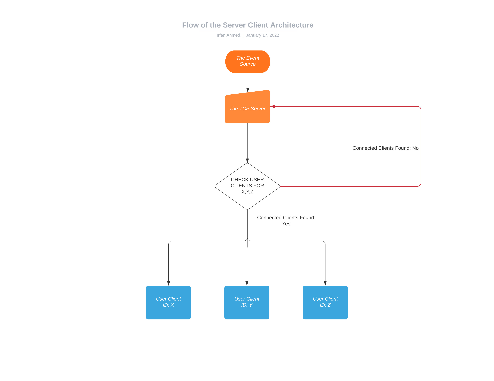

# Solution

## Interactive Mode

To play with the solution, feel free to run the command:


```bash
bin/console
```

```ruby
# To instantiate a  server
# Run in the console:

Servers::EventSource.start!

# and telnet with localhost and 9800

# TBH
```

or you can directly start the server

```bash
# in tabA for event source
bin/server
```

```bash
# in tabB, for user clients to connect
bin/server
```

And then telnet

```bash
# to emit events
telnet localhost 9800
```

```bash
# to emit user clients by id
telnet localhost 9801
```
##The flow diagram:



# Exercise
# TCP Server

The task is to write a TCP server that receives messages from an event source, and forwards them to connected user clients.

Clients connect through TCP, using a string-based protocol, in which each message is terminated by a new line. All strings are encoded in UTF-8.

The event source *connects on port 9800*, and starts sending events as soon as the connection is accepted.

The user clients *connect on port 9801* and, as soon as the connection is accepted by the server, they send a numeric ID terminated by a new line, which informs the server how they should be identified. For example, if the client sends `123\n`, the server needs to associate that connection to ID 123.

After the ID is sent, the user clients start waiting for events to be sent to them. Events coming from event source should be sent to relevant user clients without being modified.

## Protocol

The table below lists the possible messages coming from the event source and what they represent (the `\n` is implied and not included in the examples):

| *Message*         | *Sequence #* | *Type*                         | *From User ID*   | *To User ID* |
|-------------------|-----------------|--------------------------|--------------------|---------------|
| `100|F|12|36` | 100                 | Follow                         | 12                       | 36                 |
| `130|U|5|45`   | 130                 | Unfollow                      | 5                        | 45                 |
| `77|B`               | 77                   | Broadcast                    | -                         | -                    |
| `80|P|18|40`   | 80                   | Private message         | 18                       | 40                 |
| `202|S|93`       | 202                 | Status update             | 93                       | -                    |

Events may generate notifications for user clients, according to the following rules:

- Follow: Only the _To User ID_ should be notified
- Unfollow: No clients should be notified
- Broadcast: All connected user clients should be notified
- Private Message: Only the _To User ID_ should be notified
- Status Update: All current followers of the _From User ID_ should be notified

If there are no user client connected for a user, any notifications intended for them must be silently ignored. User clients expect to be notified of events in the correct order, regardless of the order in which the event source sent them.

## Example

Given the following sequence of events sent by the event source:

`6|U|1|2`, `9|F|3|1`, `2|F|1|2`, `4|S|2`, `8|B`, `1|S|2`, `3|P|5|1`, `7|S|2`, `5|S|1`

The client identified with _ID 1_ is expected to be notified of the following messages:

`3|P|5|1`, `4|S|2`, `8|B`, `9|F|3|1`

Note, for example, that it didn't receive `1|S|2`, because the _Follow_ command `2|F|1|2` happened after the _Status update_ from User 2. This is despite the _follow_ event being sent by the event source **before** the _status_ update. Again, the order of events needs to take into account the message *Sequence #*, not the order in which they were received.

## Testing

To run a basic check, start the TCP server, then run:
```
ruby test_suite/test_messages.rb
```

There are additionally some benchmarks that can be run on the `test_suite` path.
